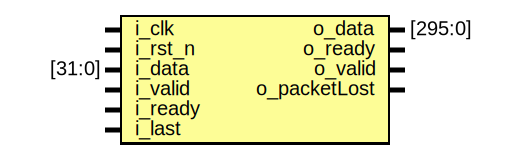
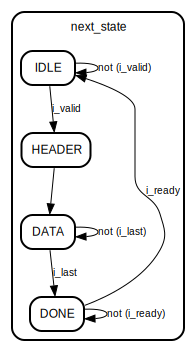

# Functionality

A packet arrives at the input data, which includes a header with a fixed format and the data with a variable length.

packet format

| 8 bytes |  variable  |
| ------- | ---------- |
| Header  |  Data      |

header format

|  2 bytes    |  2 bytes    |  4 bytes     |
| ----------- | ----------- | ------------ |
|  msgLength  |  streamId   |  seqNumber   |

For the design, the byte order in each field is assumed to be in little endian.

**msgLength**: 2 bytes, with a range of 9-45, describes the size of the packet (header+data) in bytes

**streamId**: 2 bytes, with a range of 1-32, it identifies the stream that the packet belongs to

**seqNumber**: 4 bytes, starting from 1, it increases for each packet arriving from a particular streamId. For example, a packet with streamId 15 arrives first with a seqNumber 2. The next packet arriving with a streamId 15 is expected to have a seqNumber 3.

## Transmitter Interface

| Name     | Direction | Width | Description                                                                                                                                                        |
| -------- | --------- | ----- | ------------------------------------------------------------------------------------------------------------------------------------------------------------------ |
| i_clk    | in        | 1     | Clock                                                                                                                                                              |
| i_rst_n  | in        | 1     | Active low reset                                                                                                                                                   |
| i_data   | in        | 32    | Input data for packet                                                                                                                                              |
| i_valid  | in        | 1     | Active High. Indicates that the transmitter is ready to start a data transaction which is considered to take place when both `i_valid` and `o_ready` are asserted. |
| o_ready  | out       | 1     | Active High. Indicates that the handler is ready to accept data.                                                                                                   |
| i_last   | in        | 1     | Active High. Indicates the last set of `i_data` sent by the transmitter.                                                                                           |

## Receiver Interface

| Name         | Direction | Width | Description                                                                                                                                                    |
| ------------ | --------- | ----- | -------------------------------------------------------------------------------------------------------------------------------------------------------------- |
| i_clk        | in        | 1     | Clock                                                                                                                                                          |
| i_rst_n      | in        | 1     | Active low reset                                                                                                                                               |
| o_data       | out       | 296   | Output data for payload of packet                                                                                                                              |
| o_valid      | out       | 1     | Active High. Indicates that the handler is ready to start a data transaction which is considered to take place when both `o_valid` and `i_ready` are asserted. |
| i_ready      | in        | 1     | Active High. Indicates that the receiver is ready to accept data.                                                                                              |
| o_packetLost | out       | 1     | Active high pulse for one clock cycle. Indicates seqNumber that is not continuous for the particular streamId of a packet.                                     |

## Design Overview

The approach for the design is to use an FSM with 4 states.
The design can be borken into 3 main parts:

1. The FSM, which includes:
    1. Initialization and state register defininition
    2. Next state logic
    3. Output logic (registered)
2. Serial to parallel data shift register and header seperation
3. Lost packet detection and pulse generation

RTL contains comments to help navigate through its logic and understand each part.

The testbench generates 3 packets of input. Each msgLength is 24 bytes, or 16 bytes of data plus 8 bytes for the header. The streamId is 15. These number are converted to hexadecimal and then put in little endian byte order. The data remain the same for each packet for simplicity and readability.

The first packet has a seqNumber of 1, the second 2 and the third 4, to generate an o_packetLost pulse.

Looking at the simulation output with this testbench it can be verified that the design behaves according to specification.

# Teros HDL module documentation

## Entity: packet_handler 
- **File**: packet_handler.v

## Diagram

## Ports

| Port name    | Direction | Type    | Description |
| ------------ | --------- | ------- | ----------- |
| i_clk        | input     |         |             |
| i_rst_n      | input     |         |             |
| i_data       | input     | [31:0]  |             |
| i_valid      | input     |         |             |
| i_ready      | input     |         |             |
| i_last       | input     |         |             |
| o_data       | output    | [295:0] |             |
| o_ready      | output    |         |             |
| o_valid      | output    |         |             |
| o_packetLost | output    |         |             |

## Signals

| Name                 | Type        | Description |
| -------------------- | ----------- | ----------- |
| msgLength            | reg [15:0]  |             |
| streamId             | reg [15:0]  |             |
| seqNumber            | reg [31:0]  |             |
| packetTracker [31:0] | reg [31:0]  |             |
| shiftReg             | reg [295:0] |             |
| state                | reg [3:0]   |             |
| next_state           | reg [3:0]   |             |
| o_packetLostReg      | reg         |             |
| o_packetLostReg_d    | reg         |             |

## Constants

| Name   | Type | Value   | Description |
| ------ | ---- | ------- | ----------- |
| IDLE   |      | 4'b0001 |             |
| HEADER |      | 4'b0010 |             |
| DATA   |      | 4'b0100 |             |
| DONE   |      | 4'b1000 |             |

## Processes
- unnamed: ( @(posedge i_clk or negedge i_rst_n) )
  - **Type:** always
- unnamed: ( @(*) )
  - **Type:** always
- unnamed: ( @(posedge i_clk or negedge i_rst_n) )
  - **Type:** always
- unnamed: ( @(posedge i_clk or negedge i_rst_n) )
  - **Type:** always
- unnamed: ( @(posedge i_clk or negedge i_rst_n) )
  - **Type:** always
- unnamed: ( @(posedge i_clk or negedge i_rst_n) )
  - **Type:** always

## State machines

# Notes
This is a work in progress. The goal is to proceed with synthesis and examine what technologies can be targeted and the max clock frequency it can be achieved. The design will also be optimized with storage elements.
The goal for the documentation is to be fully stand-alone and will be enriched with time.

Tools used in the project:
- EDA Playground
- Verilator
- TerosHDL
- Sigasi SVH Community Edition
- Wavedrom
