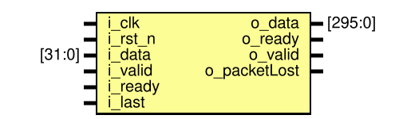
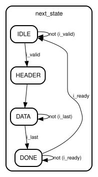

# Functionality

A packet arrives at the input data, which includes a header with a fixed format and the data with a variable length.

packet format

| 8 bytes |  variable  |
| ------- | ---------- |
| Header  |  Data      |

header format

|  2 bytes    |  2 bytes    |  4 bytes     |
| ----------- | ----------- | ------------ |
|  msgLength  |  streamId   |  seqNumber   |

For the design, the byte order in each field is assumed to be in little endian.

**msgLength**: 2 bytes, with a range of 9-45, describes the size of the packet (header+data) in bytes

**streamId**: 2 bytes, with a range of 1-32, it identifies the stream that the packet belongs to

**seqNumber**: 4 bytes, starting from 1, it increases for each packet arriving from a particular streamId. For example, a packet with streamId 15 arrives first with a seqNumber 2. The next packet arriving with a streamId 15 is expected to have a seqNumber 3.

## Transmitter Interface

| Name     | Direction | Width | Description                                                                                                                                                        |
| -------- | --------- | ----- | ------------------------------------------------------------------------------------------------------------------------------------------------------------------ |
| i_clk    | in        | 1     | Clock                                                                                                                                                              |
| i_rst_n  | in        | 1     | Active low reset                                                                                                                                                   |
| i_data   | in        | 32    | Input data for packet                                                                                                                                              |
| i_valid  | in        | 1     | Active High. Indicates that the transmitter is ready to start a data transaction which is considered to take place when both `i_valid` and `o_ready` are asserted. |
| o_ready  | out       | 1     | Active High. Indicates that the handler is ready to accept data.                                                                                                   |
| i_last   | in        | 1     | Active High. Indicates the last set of `i_data` sent by the transmitter.                                                                                           |

## Receiver Interface

| Name         | Direction | Width | Description                                                                                                                                                    |
| ------------ | --------- | ----- | -------------------------------------------------------------------------------------------------------------------------------------------------------------- |
| i_clk        | in        | 1     | Clock                                                                                                                                                          |
| i_rst_n      | in        | 1     | Active low reset                                                                                                                                               |
| o_data       | out       | 296   | Output data for payload of packet                                                                                                                              |
| o_valid      | out       | 1     | Active High. Indicates that the handler is ready to start a data transaction which is considered to take place when both `o_valid` and `i_ready` are asserted. |
| i_ready      | in        | 1     | Active High. Indicates that the receiver is ready to accept data.                                                                                              |
| o_packetLost | out       | 1     | Active high pulse for one clock cycle. Indicates seqNumber that is not continuous for the particular streamId of a packet.                                     |

## Design Overview

The RTL (`packet_handler.v`) can be broken into 3 main parts:

1. **Input FIFO**: 256 words deep, stores `{i_last, i_data}`. `o_ready` is simply `~fifo_full`, so the transmitter is only back-pressured when the FIFO is full.
2. **Lost packet detection** (input side): a small FSM (`in_state`: `IN_W1` / `IN_W2` / `IN_DATA`) watches words as they are *written* into the FIFO, keeps the last seqNumber of each of the 32 streams (`packetTracker`, plus a reset `tracker_valid` flag per stream) and raises the 1-cycle `o_packetLost` pulse. Because this happens at FIFO write time, the pulse is not aligned with the `o_valid` of the same packet.
3. **Output FSM** (read side): a one-hot FSM with 4 states (`IDLE`, `HEADER`, `DATA`, `DONE`) that pops the FIFO, separates the header, shifts the payload into a 296-bit shift register and presents it on `o_data` with `o_valid`, holding it in `DONE` until `i_ready`.

RTL contains comments to help navigate through its logic and understand each part.

The original smoke testbench (`tests/tb_smoke.v`) generates 3 packets of input. Each msgLength is 24 bytes, or 16 bytes of data plus 8 bytes for the header. The streamId is 15. These number are converted to hexadecimal and then put in little endian byte order. The data remain the same for each packet for simplicity and readability. The first packet has a seqNumber of 1, the second 2 and the third 4, to generate an o_packetLost pulse. The other testbenches are described in the [Verification Environment Guide](tests/README.md).


# Teros HDL module documentation

> [!WARNING]
> This section and the diagrams in `TerosHDL_diagrams/` and `sigasi_diagrams/` were generated from an earlier revision of the RTL, before the input FIFO was added. For example, they still list `o_packetLostReg` / `o_packetLostReg_d`, and they do not show `fifo_mem`, `fifo_*` pointers, `in_state`, `tracker_valid` or the second FSM. Regenerate them from the current `packet_handler.v` with TerosHDL / Sigasi (see [Documentation diagrams](#documentation-diagrams)).

## Entity: packet_handler 
- **File**: packet_handler.v

## Diagram

## Ports

| Port name    | Direction | Type    | Description |
| ------------ | --------- | ------- | ----------- |
| i_clk        | input     |         |             |
| i_rst_n      | input     |         |             |
| i_data       | input     | [31:0]  |             |
| i_valid      | input     |         |             |
| i_ready      | input     |         |             |
| i_last       | input     |         |             |
| o_data       | output    | [295:0] |             |
| o_ready      | output    |         |             |
| o_valid      | output    |         |             |
| o_packetLost | output    |         |             |

## Signals

| Name                 | Type        | Description |
| -------------------- | ----------- | ----------- |
| msgLength            | reg [15:0]  |             |
| streamId             | reg [15:0]  |             |
| seqNumber            | reg [31:0]  |             |
| packetTracker [31:0] | reg [31:0]  |             |
| shiftReg             | reg [295:0] |             |
| state                | reg [3:0]   |             |
| next_state           | reg [3:0]   |             |
| o_packetLostReg      | reg         |             |
| o_packetLostReg_d    | reg         |             |

## Constants

| Name   | Type | Value   | Description |
| ------ | ---- | ------- | ----------- |
| IDLE   |      | 4'b0001 |             |
| HEADER |      | 4'b0010 |             |
| DATA   |      | 4'b0100 |             |
| DONE   |      | 4'b1000 |             |

## Processes
- unnamed: ( @(posedge i_clk or negedge i_rst_n) )
  - **Type:** always
- unnamed: ( @(*) )
  - **Type:** always
- unnamed: ( @(posedge i_clk or negedge i_rst_n) )
  - **Type:** always
- unnamed: ( @(posedge i_clk or negedge i_rst_n) )
  - **Type:** always
- unnamed: ( @(posedge i_clk or negedge i_rst_n) )
  - **Type:** always
- unnamed: ( @(posedge i_clk or negedge i_rst_n) )
  - **Type:** always

## State machines



# Notes
This is a work in progress. The goal is to proceed with synthesis and examine what technologies can be targeted and the max clock frequency it can be achieved. The design may also change (or include different versions) to include a storage element to maximize throughput.

The goal for the documentation is to be fully stand-alone and will be enriched with time.

Tools used for the project:
- [EDA Playground](https://edaplayground.com/)
- [Icarus Verilog](https://steveicarus.github.io/iverilog/)
- [Verilator](https://www.veripool.org/verilator/) (including the UVM flow, based on [GettingVerilatorStartedWithUVM](https://github.com/MikeCovrado/GettingVerilatorStartedWithUVM))
- [xezim](https://github.com/aionhw/xezim)
- [cocotb](https://www.cocotb.org/)
- [Yosys](https://yosyshq.net/yosys/) with the [SkyWater Sky130](https://github.com/efabless/skywater-pdk-libs-sky130_fd_sc_hd) standard cell library
- [GTKWave](https://gtkwave.sourceforge.net/)
- [TerosHDL](https://terostechnology.github.io/terosHDLdoc/)
- [Sigasi Visual HDL](https://www.sigasi.com/) Community Edition
- [Wavedrom](https://wavedrom.com/)

# Project Roadmap
- [x] Add URLs for tools used
- [x] Add project file structure
- [x] Create testbench with cocotb or other tools
- [ ] Explore open source flows and tools (OSS Cad Suite, ProjectF, OpenROAD) and how they fit with the project's goals
- [ ] Create an installation script for OSS Cad Suite, cocotb, and xezim
- [ ] Verify design, post code and functional coverage (code coverage available via `make verilator_uvm`)
- [ ] Explore FPGA options to target specific technologies
- [ ] Look into synthesis options, explore libraries for maximum clock frequency

# Project Structure

```
.
├── packet_handler.v            # The RTL (DUT)
├── Makefile                    # Unified entry point for every flow (run `make` to list targets)
├── .github/workflows/ci.yml    # GitHub Actions CI (see "Continuous Integration" below)
├── tests/                      # Verification, see tests/README.md
│   ├── tb_smoke.v              #   legacy Verilog smoke test (waveform inspection)
│   ├── tb_basic_sv.sv          #   standalone SystemVerilog testbench (Icarus / Verilator)
│   ├── tb_uvm_sv.sv            #   UVM-style class-based SV testbench without the UVM library (Verilator)
│   ├── tb_cocotb.py            #   cocotb test suite (Icarus)
│   ├── benchmark.py            #   micro-benchmark of a Python helper used by the cocotb tests
│   ├── logs/                   #   simulation logs (generated, git-ignored)
│   └── uvm/                    #   standard IEEE 1800.2 UVM testbench, see tests/uvm/README.md
│       ├── Makefile            #     xezim and Verilator UVM flows
│       ├── tb_top.sv           #     self-contained UVM testbench (the only file that is compiled)
│       ├── verilator.vlt       #     Verilator lint/coverage/trace control file
│       ├── packet_if.sv, env/, seq/, tests/   # split-out copies of the classes in tb_top.sv (not compiled)
│       └── uvm-src/, uvm-core/, obj_dir/, logs/  # downloaded UVM libraries and build outputs (generated)
├── synth/                      # Yosys synthesis flow
│   ├── synth.tcl               #   synthesis script (Sky130 HD, typical corner)
│   ├── scripts/synth_parse.py  #   log summarizer used by `make synth_parse`
│   └── lib/                    #   downloaded Liberty file (generated, git-ignored)
├── wavedrom_diagrams/          # Interface timing diagrams (WaveDrom .json sources + rendered .svg)
├── TerosHDL_diagrams/          # TerosHDL-generated module/FSM documentation (stale, see above)
└── sigasi_diagrams/            # Sigasi-generated block diagram and HTML documentation (stale, see above)
```

# Running Every Tool

All flows are driven from the top-level `Makefile`. Run `make` with no arguments to print the list of targets and options.

> [!NOTE]
> When cocotb is installed, `make help` is intercepted by cocotb's own `help` target (its Makefile is included by ours) and prints cocotb's variables instead, then exits with an error. Use plain `make` to see the project's help text.

## Prerequisites

| Tool | Needed for | Version known to work | Install (Ubuntu) |
| ---- | ---------- | --------------------- | ---------------- |
| GNU Make, git, wget | everything | - | `sudo apt-get install make git wget` |
| Icarus Verilog | `cocotb`, `icarus` | 12.0 | `sudo apt-get install iverilog` |
| Verilator | `verilator`, RTL lint | 5.020 (Ubuntu 24.04 package) | `sudo apt-get install verilator` |
| Verilator + z3 | `verilator_uvm`, `verilator_uvm_all` | v5.052 or newer (the apt package is too old) | see [tests/uvm/README.md](tests/uvm/README.md#installing-verilator) |
| Python 3 + cocotb | `cocotb`, `benchmark` (Python only) | Python 3.10/3.11, cocotb 2.x (the tests use the cocotb 2.0 API) | `pip install cocotb` |
| xezim (Rust/cargo) | `xezim_uvm` | built from source | see [tests/uvm/README.md](tests/uvm/README.md#xezim-flow) |
| Yosys | `synth` | 0.33 | `sudo apt-get install yosys` |
| GTKWave (optional) | `GUI=1` | - | `sudo apt-get install gtkwave` |

Only the tools for the flows you want to run are required. cocotb is optional for all non-cocotb targets.

## Make targets

| Command | What it does | Outputs |
| ------- | ------------ | ------- |
| `make` | Print the project help text | - |
| `make cocotb` | Run the cocotb suite `tests/tb_cocotb.py` on Icarus | `results.xml`, `sim_build/` |
| `make icarus [TB=tb_basic_sv\|tb_smoke]` | Compile and run a SystemVerilog/Verilog testbench on Icarus (default `tb_basic_sv`) | `tests/logs/sim_icarus_<TB>.log` |
| `make verilator [TB=tb_uvm_sv\|tb_basic_sv\|tb_smoke]` | Compile with `verilator --binary -Wall` and run (default `tb_uvm_sv`) | `tests/logs/sim_verilator_<TB>.log`, `obj_dir/` |
| `make xezim_uvm` | Standard UVM testbench on xezim (downloads UVM on first run) | `tests/uvm/logs/xezim_packet_test.log` |
| `make verilator_uvm [UVM_TESTNAME=..] [SEED=..] [COV=0]` | Standard UVM testbench on Verilator v5.052+ with code coverage | `tests/uvm/logs/` |
| `make verilator_uvm_all` | Same, for every test in `ALL_TESTNAMES` | `tests/uvm/logs/` |
| `make synth` | Download the Sky130 HD Liberty file (first run) and synthesize with Yosys | `synth/synth.log`, `synth/synth_netlist.v` |
| `make synth_parse` | Summarize `synth/synth.log` (errors, warnings, area, cells). Run `make synth` first | stdout |
| `make benchmark` | Time two ways of packing 32-bit words into an integer (Python helper used by the cocotb tests); not a hardware test | stdout |
| `make clean` | Remove simulation, synthesis and UVM outputs (including downloaded UVM sources). `tests/logs/` and `synth/lib/` are kept | - |
| `verilator --lint-only -Wall packet_handler.v` | Lint the RTL (run by CI; no make target) | stdout |

Options: `WAVE=1` dumps waveforms and `GUI=1` also opens them in GTKWave (simulation targets only, see [Waveforms & Logs](tests/README.md#waveforms--logs) for where each flow writes them). `TB=<name>` selects the testbench for `icarus` / `verilator` (a `.v`/`.sv` extension is stripped).

Details for each simulation flow are in the [Verification Environment Guide](tests/README.md); the UVM flows are covered in [tests/uvm/README.md](tests/uvm/README.md).

## Synthesis

```bash
make synth          # first run downloads synth/lib/sky130_fd_sc_hd__tt_025C_1v80.lib (~13 MB)
make synth_parse    # summary of synth/synth.log
```

`synth/synth.tcl` runs from inside `synth/`: generic `synth`, flip-flop mapping (`dfflibmap`) and logic mapping (`abc`) to the Sky130 HD typical corner (25 °C, 1.80 V), then `stat` with cell areas and writes `synth_netlist.v`. There is no timing analysis step, so the flow reports area and cell counts only, not a maximum clock frequency. Sky130 HD has no RAM macro in this flow, so the 256-deep FIFO and the per-stream tracker are built from flip-flops, which dominates the area.

## Documentation diagrams

These are not generated by the Makefile:
- `wavedrom_diagrams/*.json` are [WaveDrom](https://wavedrom.com/) sources for the interface timing diagrams. Render them to SVG with the WaveDrom editor or `wavedrom-cli`.
- `TerosHDL_diagrams/` is produced by the TerosHDL VS Code extension (module documentation + FSM viewer), and `sigasi_diagrams/` by Sigasi Visual HDL (block diagram + HTML documentation export).

## Continuous Integration

`.github/workflows/ci.yml` runs on pushes and pull requests targeting `main`, `jules-experimenting` and `claude-main`. It has two jobs:

| Job | Steps |
| --- | ----- |
| `test` (ubuntu-latest, apt `iverilog` + `verilator`, Python 3.10) | RTL lint, `make cocotb`, `make icarus`, `make verilator`, build xezim from source, `make xezim_uvm` |
| `verilator-uvm` (`verilator/verilator:v5.052` container) | `make -C tests/uvm verilator`, uploads `tests/uvm/logs/` as an artifact |

`make synth`, `make icarus TB=tb_smoke`, `make verilator TB=tb_basic_sv` and `make benchmark` are not run in CI.
