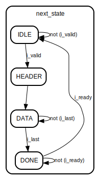

# Entity: packet_handler 
- **File**: packet_handler.v

## Diagram

## Ports

| Port name    | Direction | Type    | Description |
| ------------ | --------- | ------- | ----------- |
| i_clk        | input     |         |             |
| i_rst_n      | input     |         |             |
| i_data       | input     | [31:0]  |             |
| i_valid      | input     |         |             |
| i_ready      | input     |         |             |
| i_last       | input     |         |             |
| o_data       | output    | [295:0] |             |
| o_ready      | output    |         |             |
| o_valid      | output    |         |             |
| o_packetLost | output    |         |             |

## Signals

| Name                 | Type        | Description |
| -------------------- | ----------- | ----------- |
| msgLength            | reg [15:0]  |             |
| streamId             | reg [15:0]  |             |
| seqNumber            | reg [31:0]  |             |
| packetTracker [31:0] | reg [31:0]  |             |
| shiftReg             | reg [295:0] |             |
| state                | reg [3:0]   |             |
| next_state           | reg [3:0]   |             |
| o_packetLostReg      | reg         |             |
| o_packetLostReg_d    | reg         |             |

## Constants

| Name   | Type | Value   | Description |
| ------ | ---- | ------- | ----------- |
| IDLE   |      | 4'b0001 |             |
| HEADER |      | 4'b0010 |             |
| DATA   |      | 4'b0100 |             |
| DONE   |      | 4'b1000 |             |

## Processes
- unnamed: ( @(posedge i_clk or negedge i_rst_n) )
  - **Type:** always
- unnamed: ( @(*) )
  - **Type:** always
- unnamed: ( @(posedge i_clk or negedge i_rst_n) )
  - **Type:** always
- unnamed: ( @(posedge i_clk or negedge i_rst_n) )
  - **Type:** always
- unnamed: ( @(posedge i_clk or negedge i_rst_n) )
  - **Type:** always
- unnamed: ( @(posedge i_clk or negedge i_rst_n) )
  - **Type:** always

## State machines

